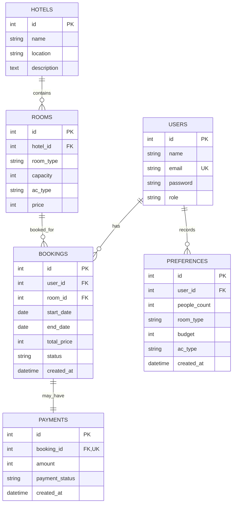

# AI-Based Online Hotel Reservation System (Flask + SQLite + React)
## Thesis-Ready Project Documentation (Final Year Project)

**Project type:** Full‑stack web application (REST API + SPA)  
**Backend:** Python Flask, Flask‑SQLAlchemy, SQLite, JWT, bcrypt, CORS  
**Frontend:** React (Vite), React Router, Tailwind CSS, Axios, Framer Motion  
**Core contribution:** Explainable, rule‑based “AI” room recommendation + complete booking flow + admin panel (RBAC)

> This document is written to be copied directly into a thesis report. Replace placeholders like **[Your Name]**, **[Department]**, **[University]**, and **[Supervisor]** as needed.

---

# Abstract
Online hotel reservation platforms often overwhelm users with many options and limited decision support. This project presents an **AI‑based online hotel reservation system** that helps users select suitable rooms through an **explainable, rule‑based recommendation engine**. The system provides user authentication, room browsing and filtering, booking with date‑overlap prevention, a demo payment step, and a history‑based “smart” recommendation insight page. An **admin panel** is included to manage hotels, rooms, and bookings using **role‑based access control (RBAC)**. The backend is implemented using **Flask REST APIs** with **SQLite** via **SQLAlchemy**, secured with **JWT tokens** and **bcrypt password hashing**. The frontend is built in **React** using **Vite**, **Tailwind CSS**, and **Axios** for API communication. The final system demonstrates a complete end‑to‑end reservation workflow and provides a defendable, transparent recommendation approach suitable for academic evaluation and viva.

**Keywords:** Hotel reservation, recommender system, rule‑based AI, Flask, React, JWT, SQLite, RBAC.

---

# Chapter 1 — Introduction
## 1.1 Background
Hotel booking is a common use case of online services. Traditional booking interfaces typically present large lists of hotels/rooms and rely on users to manually compare price, capacity, and amenities. This can be time‑consuming and may lead to poor decisions, especially for first‑time users.

## 1.2 Problem Statement
Users face two key problems:
1. **Decision difficulty:** Selecting a room matching needs (people count, AC preference, budget) is not always straightforward.
2. **Booking reliability:** Inconsistent validation can allow conflicting/overlapping bookings.

## 1.3 Proposed Solution
This project proposes a web‑based reservation system that:
- Collects a small set of user needs (people count, budget, optional AC preference, optional dates).
- Produces an **explainable recommendation** (room type + AC type + estimated price).
- Lists matching available rooms, and supports booking and confirmation.
- Prevents overlapping bookings for the same room.
- Provides an admin panel for hotel and room management and booking status updates.

## 1.4 Objectives
### Functional objectives
- User signup/login with secure password hashing.
- Browse hotels and rooms; filter rooms by price, capacity, AC type.
- Rule‑based recommendation (“AI questionnaire”).
- Booking creation with availability validation.
- Demo payment flow that marks bookings as confirmed.
- User dashboard with booking history + history‑based “smart suggestions”.
- Admin login and admin‑only APIs to manage hotels/rooms/bookings.

### Non‑functional objectives
- Security: JWT authentication, bcrypt hashed passwords, RBAC for admin routes.
- Maintainability: modular Flask blueprints and service modules.
- Usability: clean UI with Tailwind CSS and complete user flow.

## 1.5 Scope
Included:
- One application instance with seed data for demonstration.
- Room recommendation using **rules + basic personalization from history**.
- SQLite database for local development and academic demo.

Not included (out of scope):
- Real payment gateway integration (the payment endpoint is demo‑only).
- Advanced ML models (kept explainable by design).
- Multi‑property real‑world inventory sync and complex pricing rules.

---

# Chapter 2 — Literature / Related Work (Short, Thesis-Friendly)
## 2.1 Online reservation systems
Modern reservation systems typically include search, filtering, booking, and payment confirmation. The quality of the system depends on data integrity (avoiding overbooking) and user experience.

## 2.2 Recommender systems
Recommendation approaches commonly include:
- **Content‑based** methods (recommend items matching features).
- **Collaborative filtering** (recommend based on similar users).
- **Hybrid approaches** (combine content and user history).

## 2.3 Explainable AI (XAI) in decision support
For academic projects and high‑trust domains, explainability is important. Rule‑based systems provide transparent logic and clear decision paths. This project intentionally uses a **rule‑based recommender** so every decision can be explained in a viva.

---

# Chapter 3 — Methodology
## 3.1 Development approach
An iterative development approach was used:
1. Implement backend models and authentication.
2. Implement basic browsing APIs (hotels/rooms).
3. Add booking flow with overlap checks.
4. Add recommendation engine + preference tracking.
5. Add admin panel (RBAC) and management APIs.
6. Build frontend pages and integrate APIs end‑to‑end.

## 3.2 Technology stack justification
- **Flask**: lightweight, fast to develop REST APIs, clear structure with blueprints.
- **SQLite**: simple, portable, suitable for FYP demos and local development.
- **SQLAlchemy**: ORM that simplifies database interaction and schema modeling.
- **JWT**: standard token‑based auth for SPAs; integrates well with Flask.
- **bcrypt**: safe password hashing algorithm (non‑reversible).
- **React + Vite**: fast modern frontend development for SPAs.
- **Tailwind CSS**: rapid UI development with consistent design.

---

# Chapter 4 — System Requirements
## 4.1 Functional requirements
### FR‑1 User authentication
- The system shall allow users to sign up and log in.
- Passwords shall be stored as bcrypt hashes (never plaintext).
- A JWT token shall be returned on successful authentication.

### FR‑2 Room recommendation
- The system shall take inputs: people count, budget, optional AC preference, optional dates.
- The system shall return recommended room type and AC type with matching rooms.

### FR‑3 Room browsing & filtering
- The system shall list hotels and rooms.
- The system shall allow filtering by capacity, max price, AC type, and sorting.

### FR‑4 Booking creation
- The system shall create bookings for authenticated users.
- The system shall prevent overlapping bookings for a room.

### FR‑5 Payment (demo)
- The system shall simulate payment and mark booking as confirmed.

### FR‑6 Dashboard insights
- The system shall show booking history.
- The system shall show usage patterns and suggested rooms for returning users.

### FR‑7 Admin management
- The system shall allow admin login.
- Admin shall manage hotels/rooms (CRUD) and update booking status.

## 4.2 Non‑functional requirements
- Security: JWT + RBAC; hashed passwords; do not store card data.
- Performance: acceptable response time for demo data.
- Reliability: consistent validation and error handling.
- Usability: simple navigation and forms with clear feedback.

---

# Chapter 5 — System Design
## 5.1 High-level architecture
The system follows a standard client‑server architecture:
- **React SPA** communicates with **Flask REST APIs** over HTTP.
- **JWT tokens** are stored in browser storage and attached via `Authorization: Bearer <token>`.
- **SQLite database** stores users, hotels, rooms, bookings, payments, and preferences.

```mermaid
flowchart LR
  U[User Browser] -->|HTTP| FE[React SPA (Vite)]
  FE -->|Axios REST calls| BE[Flask API Server]
  BE -->|SQLAlchemy ORM| DB[(SQLite)]

  A[Admin Browser] -->|HTTP| FE
  FE -->|JWT (admin token)| BE
```

## 5.2 Backend modular design (Flask Blueprints)
Backend is organized into blueprints (modules), each owning related endpoints:
- `routes/auth.py`: `/signup`, `/login`
- `routes/recommendation.py`: `/recommend`, `/user/insights`
- `routes/rooms.py`: `/hotels`, `/rooms`, `/rooms/filter`
- `routes/bookings.py`: `/book`, `/user/bookings`
- `routes/payments.py`: `/payment` (demo)
- `routes/admin.py`: `/admin/login`, `/admin/dashboard`, `/admin/*` CRUD endpoints

## 5.3 Frontend modular design (React pages and services)
- **Pages** represent routes: Home, Login, Signup, Dashboard, Rooms, Questionnaire, Recommendation, Booking, Payment.
- **Admin pages**: AdminLogin, AdminDashboard, ManageHotels, ManageRooms, ManageBookings.
- **Services** (`src/services/*`) contain API clients and auth storage logic.

## 5.4 Database design (ER model)
Entities:
- `User`: system users and admins.
- `Hotel`: hotel information.
- `Room`: room inventory and pricing; belongs to a hotel.
- `Booking`: booking record; belongs to a user and room.
- `Payment`: one payment per booking (unique).
- `Preference`: stored recommendation inputs to learn user tendencies.



## 5.5 Security design
1. **Password security**:
   - Passwords are hashed with bcrypt before storage.
2. **User authentication**:
   - JWT is issued on login/signup; protected routes require JWT.
3. **Admin authorization (RBAC)**:
   - Admin routes require JWT and `role == "admin"`.
4. **Payment safety (demo)**:
   - Card fields are accepted only to simulate UI and are **not stored**.

---

# Chapter 6 — Implementation Details

## 6.1 Backend implementation
### 6.1.1 Application setup
- Flask app initialization loads environment variables (`.env`) and config.
- Database and extensions are initialized once and reused across modules.
- Database tables are created on startup.
- A lightweight migration helper ensures basic schema upgrades in SQLite.

Main entry:
- `backend/app.py` defines `create_app()` and registers blueprints.

Configuration:
- `backend/config.py` defines environment‑based configuration:
  - `DATABASE_URL` (defaults to `sqlite:///hotel_reservation.db`)
  - `JWT_SECRET_KEY`, `SECRET_KEY`
  - `CORS_ORIGINS`

### 6.1.2 Database models (SQLAlchemy)
`backend/models/models.py` defines the schema:
- `User` with `role` field (`user` or `admin`).
- `Hotel` and `Room` relationship (one‑to‑many).
- `Booking` links `User` and `Room` with date range and status.
- `Payment` is unique per booking.
- `Preference` stores recommendation inputs for insight generation.

### 6.1.3 Authentication (JWT) and password hashing (bcrypt)
Endpoints:
- `POST /signup`: creates a user and returns JWT.
- `POST /login`: verifies bcrypt hash and returns JWT.

JWT identity:
- `identity` stores `user.id` (string).
- `additional_claims` include role information (e.g., `{ role: "admin" }`).

### 6.1.4 Room browsing and filtering
Endpoints:
- `GET /hotels`: lists hotels.
- `GET /rooms`: lists rooms sorted by price.
- `GET /rooms/filter`: filters using query parameters:
  - `capacity` (minimum capacity)
  - `max_price`
  - `ac_type` (`AC` or `Non-AC`)
  - `hotel_id`
  - `sort` (`price_asc` or `price_desc`)

### 6.1.5 Booking creation and overlap prevention
Endpoint:
- `POST /book` (JWT required)

Validation:
- `start_date` and `end_date` must be valid `YYYY-MM-DD`.
- `end_date > start_date`.

Overlap rule (prevents double booking):
- A booking conflicts if:
  - `start < existing_end` AND `end > existing_start`
- Cancelled bookings are excluded from overlap checks.

Total price:
- `total_price = nights * room.price`

### 6.1.6 Demo payment flow
Endpoint:
- `POST /payment` (JWT required)

Behavior:
- Always returns success for demonstration.
- Creates or updates a `Payment` record (`payment_status = "paid"`).
- Updates booking status to `confirmed`.
- Does not store sensitive payment details.

### 6.1.7 Rule-based “AI” recommendation engine
Endpoint:
- `POST /recommend` (JWT required)

Inputs:
- `people_count` (integer >= 1)
- `budget` (non‑negative integer)
- `ac_preference` (optional, overrides budget rule)
- optional `start_date`, `end_date` to filter by availability

Rules (explainable):
1. **Room type rule**:
   - 1 person → `Single`
   - 2 people → `Double`
   - 3–4 people → `Triple`
   - 5+ people → `Multiple Rooms`
2. **AC type rule**:
   - If user explicitly selects AC/Non‑AC, use it.
   - Else budget rule:
     - budget < 3000 → `Non-AC`
     - otherwise → `AC`
3. **Room matching rule**:
   - Filter rooms by recommended AC type.
   - If room type is not `Multiple Rooms`, also filter by room type.
   - If dates are provided, exclude rooms that are not available (overlap logic reused).

Output:
- Recommended room type, AC type, estimated price (lowest matching price), and matching rooms list.

### 6.1.8 Smart insights for returning users
Endpoint:
- `GET /user/insights` (JWT required)

Idea:
- Use recent booking history and stored preference history to infer:
  - Most common room type
  - Most common AC preference
  - Average budget
- Suggest rooms based on these patterns.

This provides “personalization” without complex ML, keeping logic explainable.

### 6.1.9 Admin module (RBAC)
Admin authentication:
- `POST /admin/login` validates admin credentials (`role == "admin"`) and returns an admin JWT.

RBAC enforcement:
- Admin routes use middleware decorator `admin_required` which:
  - Requires JWT
  - Ensures the user exists and has `role == "admin"`

Admin capabilities:
- `GET /admin/dashboard`: totals (users, hotels, rooms, bookings)
- Hotels CRUD:
  - `POST /admin/hotels`
  - `GET /admin/hotels`
  - `PUT /admin/hotels/<id>`
  - `DELETE /admin/hotels/<id>`
- Rooms CRUD:
  - `POST /admin/rooms`
  - `PUT /admin/rooms/<id>`
  - `DELETE /admin/rooms/<id>`
- Bookings:
  - `GET /admin/bookings` with optional filters (`user_email`, `from`, `to`)
  - `PUT /admin/bookings/<id>` to update status (`pending`, `confirmed`, `cancelled`)

---

## 6.2 Frontend implementation
### 6.2.1 Routing and navigation
Routes (React Router):
- Public:
  - `/` Home
  - `/login`, `/signup`
  - `/admin/login`
- User protected (requires `token`):
  - `/dashboard`
  - `/questionnaire`
  - `/recommendation`
  - `/rooms`
  - `/book/:roomId`
  - `/payment/:bookingId`
- Admin protected (requires `admin_token` and `role == "admin"`):
  - `/admin` dashboard
  - `/admin/hotels`
  - `/admin/rooms`
  - `/admin/bookings`

### 6.2.2 Auth storage
- User token/user object stored in `localStorage` (`token`, `user`).
- Admin token/admin user stored separately (`admin_token`, `admin_user`).
- Axios interceptors attach JWT automatically to requests.

### 6.2.3 User flow implementation
1. Signup/Login → user token saved.
2. Questionnaire → calls `/recommend`, stores response in `sessionStorage`.
3. Recommendation page → shows result and matching rooms; booking link.
4. Booking page → date selection + price preview → `/book`.
5. Payment page → demo `/payment` → redirect to dashboard.
6. Dashboard → loads `/user/bookings` and `/user/insights`.

### 6.2.4 Admin flow implementation
1. Admin login → stores admin token and admin user.
2. Admin dashboard → calls `/admin/dashboard`.
3. Manage hotels/rooms → CRUD operations.
4. Manage bookings → list + filter + status update.

---

# Chapter 7 — API Specification (Thesis Table Format)

Base URL (local dev): `http://127.0.0.1:5000`

## 7.1 Authentication
| Method | Endpoint | Auth | Description |
|---|---|---:|---|
| POST | `/signup` | No | Create user account, return JWT + user object |
| POST | `/login` | No | User login, return JWT + user object |

## 7.2 User browsing
| Method | Endpoint | Auth | Description |
|---|---|---:|---|
| GET | `/hotels` | No | List hotels |
| GET | `/rooms` | No | List rooms |
| GET | `/rooms/filter` | No | Filter rooms by query params |

## 7.3 Recommendation and insights
| Method | Endpoint | Auth | Description |
|---|---|---:|---|
| POST | `/recommend` | Yes | Generate recommendation + matching rooms |
| GET | `/user/insights` | Yes | Return history patterns + suggested rooms |

## 7.4 Booking and payment
| Method | Endpoint | Auth | Description |
|---|---|---:|---|
| POST | `/book` | Yes | Create booking if available |
| GET | `/user/bookings` | Yes | List user’s bookings |
| POST | `/payment` | Yes | Demo payment and booking confirmation |

## 7.5 Admin APIs (RBAC)
| Method | Endpoint | Auth | Description |
|---|---|---:|---|
| POST | `/admin/login` | No | Admin login (role must be admin) |
| GET | `/admin/dashboard` | Admin | Dashboard totals |
| POST | `/admin/hotels` | Admin | Create hotel |
| GET | `/admin/hotels` | Admin | List hotels |
| PUT | `/admin/hotels/<id>` | Admin | Update hotel |
| DELETE | `/admin/hotels/<id>` | Admin | Delete hotel |
| POST | `/admin/rooms` | Admin | Create room |
| PUT | `/admin/rooms/<id>` | Admin | Update room |
| DELETE | `/admin/rooms/<id>` | Admin | Delete room |
| GET | `/admin/bookings` | Admin | List bookings + filters |
| PUT | `/admin/bookings/<id>` | Admin | Update booking status |

---

# Chapter 8 — Testing and Validation
## 8.1 Validation strategy (recommended for thesis)
Because this is an FYP demo system, testing can be presented as:
- **API-level validation**: verify correct responses and error codes.
- **Functional UI testing**: verify complete user flow with seeded data.
- **Security validation**: verify JWT is required for protected endpoints and admin RBAC blocks unauthorized access.

## 8.2 Test cases (examples)
### Authentication
- Signup with missing fields → `400`
- Signup with existing email → `409`
- Login with wrong password → `401`

### Recommendation
- people_count < 1 → `400`
- budget < 0 → `400`
- With dates: booked room excluded from results

### Booking
- end_date <= start_date → `400`
- Overlapping booking attempt → `409`
- Booking with non-existent room → `404`

### Admin RBAC
- Calling admin endpoints without token → `401/422` (JWT dependent)
- Calling admin endpoints with user token (role=user) → `403`
- Admin login with non-admin user → `401`

---

# Chapter 9 — Results and Discussion
## 9.1 Achieved outcomes
- Implemented a complete reservation workflow from signup to booking confirmation.
- Implemented overlap‑safe booking logic.
- Implemented an explainable rule‑based recommendation engine.
- Added lightweight personalization via insights from user history.
- Delivered a working admin panel with RBAC‑protected management APIs.

## 9.2 Discussion
The recommendation approach is intentionally rule-based to maximize transparency and viva‑readiness. While advanced ML could improve accuracy, it also increases complexity, reduces explainability, and requires larger datasets. For an academic demonstration, explainability, reliability, and end‑to‑end completeness are prioritized.

---

# Chapter 10 — Conclusion and Future Work
## 10.1 Conclusion
This project demonstrates a practical full‑stack hotel reservation system with explainable AI recommendations and secure user/admin functionality. The system ensures data integrity using booking overlap prevention, provides a realistic user experience, and supports administration tasks through RBAC‑protected APIs.

## 10.2 Future enhancements
- Replace demo payment with a real gateway (Stripe/JazzCash/EasyPaisa) using secure tokenization.
- Add hotel images, amenities, and dynamic pricing rules.
- Add cancellation policies and refunds.
- Implement email notifications (booking confirmation, reminders).
- Add proper database migrations with Alembic for production readiness.
- Enhance recommendations using hybrid methods (content + collaborative filtering) while preserving explainability.

---

# Appendix A — Installation and Running (Local Development)
## A.1 Backend (Flask)
From the repository root:
```powershell
cd .\backend
python -m venv .venv
.\.venv\Scripts\Activate.ps1
pip install -r requirements.txt
copy .env.example .env
python seed.py
python app.py
```
Backend runs at: `http://127.0.0.1:5000`

## A.2 Frontend (React)
```powershell
cd ..\frontend
copy .env.example .env
npm install
npm run dev
```
Frontend runs at: `http://localhost:5173`

## A.3 Seeded admin account
- Email: `admin@test.com`
- Password: `123456`
- Admin login URL: `http://localhost:5173/admin/login`

---

# Appendix C — Deployment Notes (Optional Thesis Section)
This project is configured primarily for local development and demonstration. For a production-style deployment, the following approach is recommended:

## C.1 Backend
- Run Flask behind a production WSGI server (e.g., Gunicorn/Waitress) instead of `python app.py`.
- Move secrets (`SECRET_KEY`, `JWT_SECRET_KEY`) into server environment variables.
- Use a production database (e.g., PostgreSQL/MySQL) instead of SQLite for concurrency and reliability.

## C.2 Frontend
- Build static assets using:
  - `npm run build`
- Host the generated `frontend/dist` on a static server (Nginx, Apache, or a cloud static host).
- Configure `VITE_API_URL` to point to the deployed backend API base URL.

---

# Appendix B — File/Module Guide (Quick Reference)
## Backend
- `backend/app.py`: app factory + blueprint registration
- `backend/config.py`: environment-based configuration
- `backend/extensions.py`: Flask extensions (db, bcrypt, jwt)
- `backend/models/models.py`: SQLAlchemy models (schema)
- `backend/routes/auth.py`: signup/login
- `backend/routes/rooms.py`: hotels/rooms/filter
- `backend/routes/bookings.py`: booking creation + user bookings
- `backend/routes/payments.py`: demo payment
- `backend/routes/recommendation.py`: recommend + insights
- `backend/routes/admin.py`: admin dashboard + management APIs
- `backend/utils/recommender.py`: rule-based recommender + insights
- `backend/utils/authz.py`: `admin_required` RBAC middleware
- `backend/utils/migrations.py`: lightweight SQLite schema upgrades
- `backend/seed.py`: seeds admin/hotels/rooms

## Frontend
- `frontend/src/App.jsx`: route map
- `frontend/src/services/api.js`: Axios client (user JWT)
- `frontend/src/services/auth.js`: login/signup helpers
- `frontend/src/services/storage.js`: token/user localStorage
- `frontend/src/services/adminApi.js`: Axios client (admin JWT)
- `frontend/src/services/adminAuth.js`: admin login/logout
- `frontend/src/services/adminStorage.js`: admin localStorage
- `frontend/src/pages/*`: user pages
- `frontend/src/pages/admin/*`: admin pages
- `frontend/src/components/*`: reusable UI components + route guards
